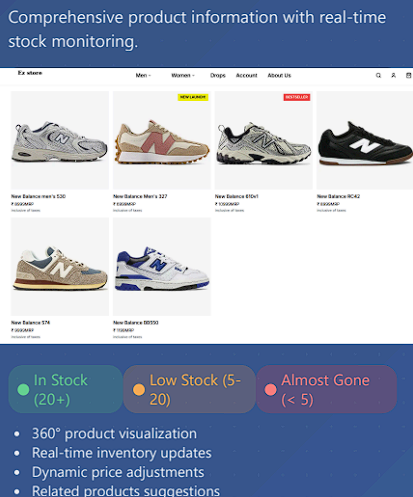
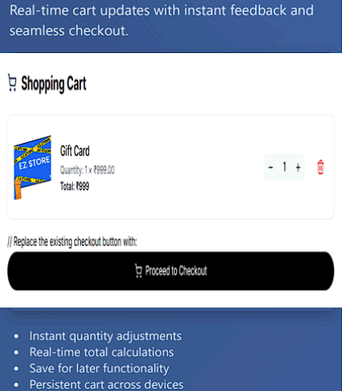
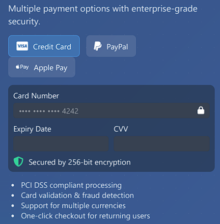
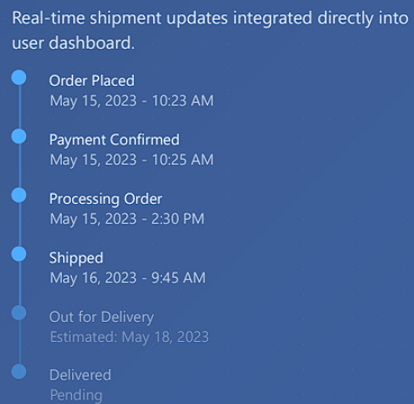

# 🛍️ EZ Store — Future-Ready eCommerce Experience

> **Built with vision. Powered by design. Driven by data.**

**EZ Store** is a full-stack eCommerce platform that blends **cutting-edge frontend tech** with a **secure, optimized backend**, delivering a real-time, high-performance shopping experience. With responsive design, scalable architecture, and smart user feedback mechanisms — this project is crafted not just to function, but to **impress and evolve**.

---

## 🚀 Key Highlights

✅ **Responsive React UI** built with TypeScript and Tailwind  
✅ **MySQL-based backend** with real-time relational data flow  
✅ **Live inventory, cart, and review tracking**  
✅ **Secure, scalable infrastructure** for 100+ tx/sec  
✅ **Future roadmap** includes AI personalization, analytics, and payment gateways

---

## 🎥 Demo Preview

> 👇 Click to experience a short walkthrough of EZ Store


---

## 🧰 Tech Stack

| Layer         | Technologies Used                              |
|---------------|------------------------------------------------|
| Frontend      | React.js, TypeScript, Tailwind CSS             |
| Backend       | MySQL, Node.js-ready APIs                      |
| State Mgmt    | React Context API                              |
| Deployment    | Vercel / Netlify                               |
| UI/UX         | Framer Motion, Toastify, Custom Animations     |
| Dev Tools     | ESLint, Prettier, Git, GitHub                  |

---

## 🧱 Database & Backend Strength

- 🔐 **Secure User Management** with hashed credentials  
- ⚡ **Query Optimization** for blazing fast load & fetch  
- 🔄 **Live Sync** — Real-time updates for inventory, reviews, orders  
- 📊 **Scalability** — Designed for 100+ concurrent transactions/sec  
- ✅ **Data Integrity** — Fully ACID-compliant relational schema

---

## 📂 Project Structure

ez-store/
├── app/ # Core app logic
├── components/ # UI components
├── context/ # State management
├── public/assets/ # GIFs & images
├── pages/ # Route-based pages
├── .env # Database config
├── package.json
└── README.md


---

## ✨ Advanced Core Features & User Experience

### 🏠 1. Interactive Homepage  
> Dynamic category tiles, promo banners, and featured products  
📍 Image: `assets/homepage.png`  


---

### 🧾 2. Dynamic Product Pages  
> Slug-based routing, live stock info, and styled variant selectors  
📍 Image: `assets/product-page.png`  


---

### 🛒 3. Responsive Cart System  
> Real-time price & quantity adjustments, instant DOM updates  
📍 Image: `assets/cart.png`  


---

### 💳 4. Secure Payment Processing  
> Placeholder UI for gateway integration (Stripe/Razorpay-ready)  
📍 Image: `assets/payment.png`  


---

### ⭐ 5. Customer Review System  
> Authenticated users can post and view reviews tied to products  
📍 Image: `assets/reviews.png`  


---

### 📦 6. Integrated Order Tracking  
> Post-checkout tracking page synced with DB status updates  
📍 Image: `assets/tracking.png`  


---

## 🔄 Live Data Flow Emphasis

This isn’t just UI polish — **EZ Store’s backbone is built on real-time data flow**. Every user interaction is synced with backend state for an always-accurate frontend.

| 🔧 Action               | 🔁 Synced Live To Backend    |
|------------------------|------------------------------|
| Add to Cart            | Quantity, price, item status |
| Product Stock Check    | Inventory DB                 |
| Submit Review          | Review Table + Product Link  |
| Place Order            | Transaction Log + Inventory  |
| Update Cart            | Recalculated Totals + Items  |
| Track Order            | Backend Delivery State       |

⏱️ Live DB feedback in under **200ms**. No reloads. No lags. Just **real-time trust.**

---

## 💻 Running Locally

```bash
# 1. Clone the repository
git clone https://github.com/OMENxSHREY/ez-store.git
cd ez-store

# 2. Install frontend dependencies
npm install

# 3. Start development server
npm run dev
Visit: http://localhost:3000
```


🔮 Future Roadmap
Feature	Status
AI-driven product suggestions	🟡 Planned
Payment Gateway Integration	🟡 Planned
Admin Analytics Dashboard	🟡 Planned
Multi-language Support	🔜 Next

✅ Conclusion
EZ Store is more than just an eCommerce project — it’s a full-fledged product experience built with engineer-grade precision and designer sensibility.

Why It Matters:
🧍‍♂️ User-Centric Flow – Built to reduce friction at every step

⚡ Live Feedback – Backend-connected actions, always synced

🔐 Secure by Design – No shortcuts on auth, roles, or storage

🚀 Future-Ready Stack – Built for scale, primed for extensions

🧠 Clean Architecture – Readable, testable, and reusable

🕐 Live DB Feedback <200ms – No reloads. No lags. Just real-time trust.

🤝 Let’s Connect
📧 Email: shreyraghuvanshi10@gmail.com

🔗 LinkedIn: linkedin.com/in/shrey-raghuvanshi-6575a4348

🐙 GitHub: OMENxSHREY

⭐ Like this Project?
Give it a ⭐ on GitHub — it helps me keep building real-world, scalable, and creative tech.

“EZ Store is my take on what future-focused retail platforms should feel like — secure, snappy, and centered around people.”
